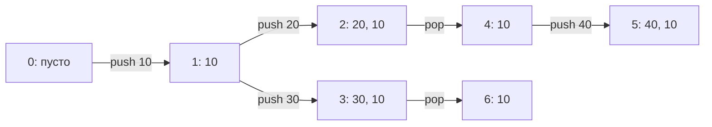
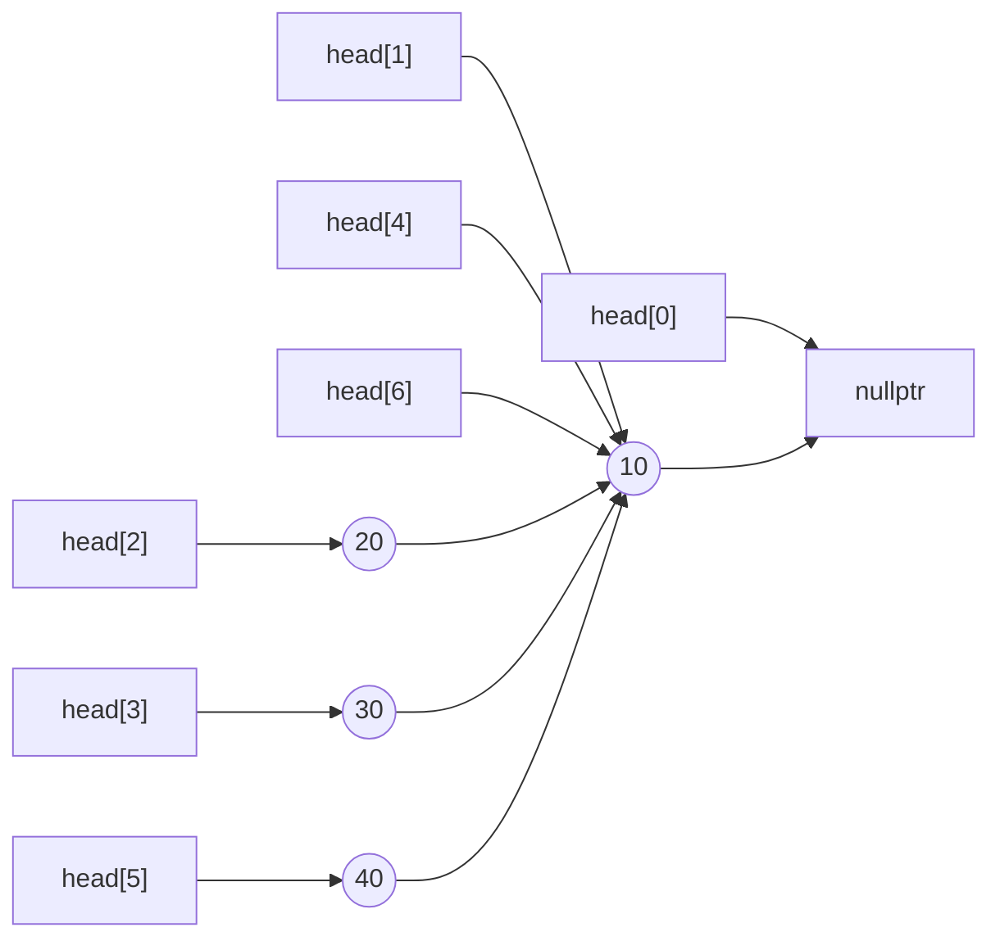
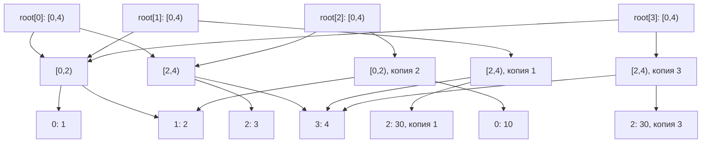

# Персистентные структуры данных: разбор для преподавателя

Главная идея: версия задаётся небольшим набором указателей и параметров.
Неизменившиеся узлы доступны из нескольких версий одновременно. Сохранять
каждую структуру целиком не требуется.

Вспомогательные приёмы: односвязный список, дерево отрезков на указателях,
копирование пути, циклическая индексация. Последовательность задач отделяет
эти приёмы друг от друга: сначала меняется только способ хранения истории,
затем форма структуры и, наконец, её интерфейс.

Основные ошибки, которые должен выявить листок: изменение общего узла,
освобождение ещё используемой памяти, смешение номера команды и версии,
путаница между количеством версий и узлов, перенос амортизированной оценки
с линейной истории на ветвящуюся без нового доказательства.

## Как провести семинар

| Время | Работа |
| --- | --- |
| 0–10 минут | Задача 1: стек на списке, указатели до и после операций. |
| 10–35 минут | История стека на доске, затем задача 2. Не сокращать обсуждение общих узлов. |
| 35–45 минут | Задача 3: восстановить `build`, `getElement`, `setElement` по готовому коду или написать вместе. |
| 45–75 минут | Рисунок версий массива, задача 4, подсчёт узлов. |
| 75–90 минут | Обсуждение очереди, контрпример для двух стеков, постановка домашней задачи 5. |

Если студенты пишут всё с нуля, на первом семинаре выполните задачи 1–3, на
втором — задачу 4 и обсуждение очереди. Дополнительное чтение в конце этого
файла выдайте после обсуждения; реализацию очереди на пяти-шести стеках на
семинаре не требуйте.

## 1. Стек на списке

### Идея и состояние

`head` указывает на вершину, а `next` каждого узла — на следующий элемент
стека. Пустой стек представлен `nullptr`.

`push x` создаёт узел `{x, head}` и делает его новой вершиной. `pop` сохраняет
старую вершину, переводит `head` на её `next`, выводит значение и освобождает
снятый узел. `top` только читает значение `head->x`.

### Корректность

Инвариант: обход списка от `head` перечисляет элементы от вершины к основанию.
Изначально список пуст. Добавление помещает новый элемент перед всей прежней
последовательностью. Удаление убирает её первый элемент, оставляя хвост без
изменений. Следовательно, обе операции сохраняют инвариант и реализуют LIFO.
Ответы `top` и `pop` берутся из первого узла, поэтому они корректны.

### Сложность и крайние случаи

Каждая команда выполняет постоянное число действий и работает за `O(1)`.
При размере `s` существуют ровно `s` узлов. После всех команд оставшийся
список освобождается за `O(s)` без рекурсии.

Важно проверить снятие последнего элемента, новое добавление в пустой стек,
одинаковые и отрицательные значения. Нельзя обращаться к `old->next` после
`delete old`. Для обычного стека удаление узла безопасно, поскольку ни одна
другая версия на него не ссылается.

## 2. Персистентный стек

### Ответ к упражнению на доске

| Версия | Родитель и операция | Содержимое от вершины | Новые узлы списка |
| --- | --- | --- | --- |
| 0 | Начальная | `[]` | 0 |
| 1 | `push 0 10` | `[10]` | 1 |
| 2 | `push 1 20` | `[20, 10]` | 1 |
| 3 | `push 1 30` | `[30, 10]` | 1 |
| 4 | `pop 2` | `[10]` | 0 |
| 5 | `push 4 40` | `[40, 10]` | 1 |
| 6 | `pop 3` | `[10]` | 0 |

Дерево происхождения версий:

Узлы в памяти и указатели версий:

Созданы четыре узла и семь записей о версиях, включая начальную. У версий
`1`, `4`, `6` один указатель на вершину. Дерево происхождения версий и граф
указателей в памяти — разные объекты.

### Идея и переходы

Храним массив указателей `head[v]`. Узел после создания никогда не меняется.

- `push v x`: создаём узел `{x, head[v]}` и записываем его адрес в новую версию.
- `pop v`: указателем новой версии становится `head[v]->next`.
- `top v`: читаем `head[v]->x`.

**Каждый `push` и каждый `pop` создаёт версию. Только `push` создаёт узел.**
Номер следующей версии увеличиваем лишь в изменяющих командах. Даже если
после `pop` получился уже известный список, новая запись о версии обязательна.

### Корректность

Инвариант: список из `head[v]` задаёт содержимое версии `v`; все опубликованные
узлы неизменяемы. При добавлении новый узел имеет требуемое значение и ведёт
в точности в прежний список. При удалении новый указатель задаёт его хвост.
Обе операции корректны по определению стека и не меняют ни одного старого
узла. По индукции по числу команд все версии остаются корректными, включая
ветки, созданные из давних версий.

### Память и сложность

Все команды работают за `O(1)`. После `p` добавлений создано ровно `p` узлов,
после `u` изменяющих команд существуют `u + 1` записей о версиях. В коде таблица
версий заранее выделена на `q + 1` элементов, поэтому общая память — `O(q)`.

Узлы хранятся в `std::deque<Node>`: добавление в конец сохраняет адреса
элементов. Дек здесь используется только как хранилище узлов, а логика стека
реализована указателями. При выходе из программы хранилище освобождается
целиком. Указатели на опубликованные узлы имеют тип `const Node*`.

В `pop` нельзя освобождать снятый узел: он остаётся вершиной исходной версии.
Также нельзя обнулять его `next`. Нельзя хранить адреса элементов растущего
`vector<Node>` без гарантии отсутствия перераспределения памяти. Рекурсивное
удаление каждого списка в конце привело бы к повторному освобождению общих узлов.

### Устное дополнение: размер

Можно хранить `size[v]` рядом с указателем: начальный размер равен нулю,
`push` увеличивает размер исходной версии на один, `pop` уменьшает на один.
Другой вариант — длина списка в каждом узле: `1 + size(next)`, где размер
`nullptr` равен нулю. Оба способа дают `size v` за `O(1)` и не меняют числа
создаваемых узлов. Второй вариант естественно разделяет метаданные вместе
с общими хвостами. В эталонном коде это устное расширение не реализовано.

## 3. Массив на дереве отрезков

### Идея и состояние

Узел `v` отвечает за полуинтервал `[l, r)`. Если `r - l = 1`, он хранит
`a[l]`. Иначе `m = (l + r) / 2`, левый ребёнок отвечает за `[l, m)`, правый —
за `[m, r)`. Границы передаются в рекурсивные функции и не хранятся в узлах.
Поле значения во внутренних узлах не используется.

`build` строит оба поддерева и их родителя. `getElement` спускается в ребёнка,
которому принадлежит индекс. `setElement` проходит тот же путь и меняет
значение в листе. Внутренние узлы пересчитывать не нужно: агрегатов нет.

### Корректность

При построении дети разбивают отрезок родителя без пересечений и пропусков.
По индукции по длине отрезка каждому индексу соответствует ровно один лист
с начальным значением. При чтении и изменении выбор ребёнка сохраняет
принадлежность индекса текущему отрезку, поэтому мы приходим в нужный лист.
Изменение этого листа не затрагивает другие элементы массива.

### Сложность и крайние случаи

Дерево имеет `n` листьев и `n - 1` внутренних узлов: всего `2n - 1`.
Построение занимает `O(n)`, чтение и изменение — `O(L(n))`. Память под дерево
и входной массив — `O(n)`, глубина рекурсии — `O(L(n))`.

Обход `print` посещает каждый узел один раз и выводит листья слева направо
за `O(n)`. Печать через отдельный `getElement` для каждого индекса требует
`O(n * L(n))`. Функция `print` не входит в эталонный интерфейс ввода-вывода.

Проверьте `n = 1`, неполную последнюю ступень при `n = 3` или `5`, первый
и последний индексы. Условие остановки — длина отрезка один. Смешение
полуинтервалов с включённой правой границей часто приводит к неверному спуску
или бесконечной рекурсии.

## 4. Персистентный массив

### Ответ к упражнению на доске

| Команда | Вывод | Созданная версия | Содержимое новой версии | Новые узлы |
| --- | --- | --- | --- | --- |
| `set 0 2 30` | `1` | 1 | `[1, 2, 30, 4]` | 3 |
| `get 0 2` | `3` | Нет | — | 0 |
| `set 0 0 10` | `2` | 2 | `[10, 2, 3, 4]` | 3 |
| `set 1 2 30` | `3` | 3 | `[1, 2, 30, 4]` | 3 |

Версия `0` сохраняет `[1, 2, 3, 4]`. На рисунке внутренние узлы подписаны
отрезками, листья — индексами и значениями:

Начальное дерево содержит семь узлов. После трёх изменений их шестнадцать.
Корни версий `1` и `3` различны, хотя массивы совпадают. В задаче намеренно
зафиксировано копирование пути и при присваивании прежнего значения.

### Идея и переходы

Храним `root[v]` для каждой версии. `build` и `getElement` сохраняют прежнюю
логику. Изменяется контракт `setElement`: он получает старый узел и возвращает
корень нового поддерева.

1. Скопировать текущий узел.
2. Если это лист, записать в копию новое значение.
3. Иначе рекурсивно построить новую версию только нужного ребёнка и заменить
   в копии указатель на него. Указатель на второго ребёнка оставить прежним.
4. Вернуть адрес копии.

После возврата из рекурсии новый корень записывается под следующим номером
версии. Старый корень остаётся доступен.

**Только `set` создаёт версии и узлы. `get` только читает.** Каждый `set`
копирует путь, а остальные поддеревья остаются общими. Если копировать только
корень, а затем менять старый лист, изменение будет видно и старым версиям.

### Корректность

Докажем контракт `setElement` по длине отрезка: возвращённое поддерево хранит
исходные значения, кроме указанного индекса, а старое поддерево не изменяется.
В листе контракт выполняется непосредственным созданием копии. Во внутреннем
узле по предположению индукции нужный ребёнок получает ровно одно изменение.
Второй ребёнок сохраняется целиком. Свежий родитель соединяет эти поддеревья,
а старый родитель не меняется. Это доказывает контракт и сохранность всех
предыдущих версий. Корректность чтения следует из разбора задачи 3.

### Сложность и управление памятью

На пути к листу не более `L(n)` узлов. Чтение и изменение занимают `O(L(n))`.
Если глубина конкретного листа равна `d` рёбрам, изменение создаёт ровно `d + 1`
узлов. При `n = 2^h` это ровно `h + 1`, а при произвольном `n` длины путей могут
отличаться. Нельзя говорить, что всегда создаётся ровно `log2(n)` узлов.

После `p` изменений число узлов не превышает
`2n - 1 + p * L(n)`. Таблица корней занимает `O(q)`, рекурсия — `O(L(n))`.
Полная память — `O(n + p * L(n) + q)`, что укладывается в ограничение условия.

Как и у стека, хранилище `deque<Node>` сохраняет адреса узлов. В
`setElement` копия создаётся до рекурсивного вызова; её адрес остаётся
действительным после добавлений в хранилище. Старые узлы доступны через
`const Node*`, изменяется лишь ещё не опубликованная копия `Node*`.

Проверьте ветвление из версии `0`, чтение старой версии после многих изменений,
повторное присваивание прежнего значения, несколько чтений между изменениями
и `n = 1`. При `n = 1` каждый `set` создаёт один лист, который одновременно
является корнем.

## Обсуждение очереди

### Список с двумя концами

Пусть исходная очередь — `a -> b`. Добавление `c` в обычной очереди записывает
`b.next = c`. Добавление `d` из той же исходной версии потребовало бы другого
значения `b.next`. Общий узел нельзя изменять ни в одной ветке.

Одной копии `b` недостаточно: `a.next` по-прежнему ведёт в старый `b`. Для
односвязного списка с указателем на начало придётся копировать весь путь
к концу. По этой причине непосредственное добавление в конец требует
линейного времени и памяти. Стек не имел такой проблемы: новый узел создавался
перед старой последовательностью.

### Два стека и амортизация

В обычной очереди каждый элемент один раз попадает во входной стек, не более
одного раза переносится в выходной и не более одного раза удаляется из него.
Поэтому суммарная стоимость последовательности из `m` операций — `O(m)`.

В варианте из упражнения создадим за `m` добавлений версию `v`, в которой
выходной стек пуст, а входной содержит `m` элементов. Каждый из `m` запросов
`pop v` снова переносит все `m` элементов. Исходная версия не меняется,
результат переноса не кешируется. Получаем `m` полных переносов и `m^2`
перенесённых элементов, то есть `Theta(m^2)` работы за `2m` команд. В такой
реализации перенос также создаёт `Theta(m^2)` узлов выходных стеков.

Наивная конструкция на двух персистентных стеках корректно хранит очереди,
но этот пример опровергает заявленную общую оценку `O(1)` на команду. Доказать
оценку вдоль одной цепочки версий недостаточно. Проблема повторного разворота
при обращениях к одной старой версии разобрана также в разделе 2 статьи
[Chris Okasaki, «Simple and efficient purely functional queues and deques»](https://www.cambridge.org/core/services/aop-cambridge-core/content/view/7B3036772616B39E87BF7FBD119015AB/S0956796800001489a.pdf/simple-and-efficient-purely-functional-queues-and-deques.pdf).

Для очереди с постоянным временем в худшем случае перенос распределяют между
несколькими операциями и хранят состояние незавершённой перестройки. Это
требует дополнительных инвариантов; конструкции на пяти-шести стеках —
отдельное упражнение. В домашней задаче достаточно логарифмической оценки.

## 5. Персистентная очередь на циклическом массиве

### Состояние и инвариант

Версия очереди — тройка `(root, head, size)`. Она описывает персистентный
массив вместимости `c`, индекс первого элемента и количество живых элементов.
Всегда `0 <= head < c`, `0 <= size <= c`.

Инвариант: элемент очереди с порядковым номером `j`, `0 <= j < size`, хранится
в ячейке `(head + j) % c` массива `root`. Остальные ячейки не относятся к
очереди и могут содержать любые значения.

Версия `0` имеет `head = 0`, `size = 0`; дерево строится с нулевыми листьями.
Ноль не служит признаком пустой ячейки: он может быть обычным элементом.
Хранить размер нужно в том числе для различения пустой и полной очереди,
у которых циклические индексы начала и конца могут совпадать.

### Переходы

- `push v x`: взять копию тройки версии `v`; выполнить персистентный `set`
  в позиции `(head + size) % c`; заменить корень и увеличить размер.
- `pop v`: прочитать элемент в `head`; оставить корень прежним, заменить
  `head` на `(head + 1) % c` и уменьшить размер.
- `front v`: прочитать элемент в `head`.
- `size v`: вернуть сохранённый размер.

Первые две команды сохраняют тройку под новым номером. Даже после `pop` из
одноэлементной очереди новый `head` не обязан равняться нулю. Он остаётся
корректным индексом для следующего добавления.

Очищать удалённую ячейку не требуется: изменившиеся `head` и `size` исключают
её из последовательности. При последующей записи в освободившуюся позицию
персистентный массив сохраняет старые значения для всех прежних версий.

### Корректность

Начальная очередь пуста, поэтому инвариант выполнен. Перед `push` размер
строго меньше `c`: новая позиция отличается от позиций всех живых элементов
текущей версии. Изменение этой позиции дописывает ровно один элемент в конец.
Персистентное изменение массива не затрагивает другие версии.

При `pop` индекс нового элемента с номером `j` равен
`(head + 1 + j) % c`, то есть индексу старого элемента `j + 1`. Уменьшение
размера удаляет только первый элемент. Поскольку меняется лишь копия тройки,
старая очередь сохраняется. Чтение первого элемента и размера корректно
непосредственно по инварианту.

### Пример перехода через конец массива

Для вместимости `3` последовательно добавим `10`, `20`, `30`, удалим `10`
и добавим `40`:

| Версия | Массив в листьях | `head` | `size` | Очередь |
| --- | --- | --- | --- | --- |
| 0 | `[0, 0, 0]` | 0 | 0 | `[]` |
| 1 | `[10, 0, 0]` | 0 | 1 | `[10]` |
| 2 | `[10, 20, 0]` | 0 | 2 | `[10, 20]` |
| 3 | `[10, 20, 30]` | 0 | 3 | `[10, 20, 30]` |
| 4 | `[10, 20, 30]` | 1 | 2 | `[20, 30]` |
| 5 | `[40, 20, 30]` | 1 | 3 | `[20, 30, 40]` |

У версий `3` и `4` один корень массива. У версии `5` новый корень, а значение
в позиции `0` старой версии `3` по-прежнему равно `10`. Дальнейшие команды
в приложенном примере проверяют отдельную ветку из версии `1`.

### Сложность и крайние случаи

Построение дерева занимает `O(c)` времени и создаёт `2c - 1` узлов.
`push` работает за `O(L(c))` и создаёт не более `L(c)` узлов.
`pop` и `front` работают за `O(L(c))` из-за чтения элемента и не создают
узлов дерева. Хотя изменение тройки при `pop` занимает `O(1)`, вся команда
должна вывести удалённый элемент, поэтому её оценка логарифмическая.
`size` работает за `O(1)`.

После `p` добавлений число узлов не превышает `2c - 1 + p * L(c)`.
Таблица версий занимает `O(q)`, общая память — `O(c + p * L(c) + q)`.
Число версий очереди может превышать число различных корней внутреннего массива.

Проверьте `c = 1`, опустошение и повторное заполнение, полную очередь,
переход индексов через ноль, отрицательные и нулевые значения, две ветки,
перезаписывающие одну позицию разными числами. Нельзя вычислять `head` или
`size` из последней созданной версии: они берутся из указанной версии `v`.
Глобальный изменяемый циклический массив не сохранял бы старые очереди.

## Дополнительное чтение после семинара

- [Robert Hood, Robert Melville. Real Time Queue Operations in Pure LISP](https://ecommons.cornell.edu/entities/publication/ddc7b5af-c5ea-43dc-889e-bab2a00278bc).
  Технический отчёт Cornell, 1980. Постепенный разворот списка распределяет
  работу между операциями очереди; это материал для самостоятельного разбора
  состояний перестройки.
- [Chris Okasaki. Simple and efficient purely functional queues and deques](https://www.cambridge.org/core/services/aop-cambridge-core/content/view/7B3036772616B39E87BF7FBD119015AB/S0956796800001489a.pdf/simple-and-efficient-purely-functional-queues-and-deques.pdf).
  Journal of Functional Programming, 1995, 5(4), 583–592. Начать с раздела 2
  об очереди на двух списках и повторных обращениях к старой версии, затем
  изучить ленивые списки и планирование вычислений для постоянного времени
  операции в худшем случае. Статья использует ленивые вычисления; это отдельная
  конструкция, не пошаговая инструкция к домашней задаче на C++.

Вопрос для самостоятельной работы: какие дополнительные состояния и инварианты
нужны, чтобы выполнять лишь постоянное число шагов переноса за одну операцию
и продолжать корректно отвечать на запросы во время перестройки?
